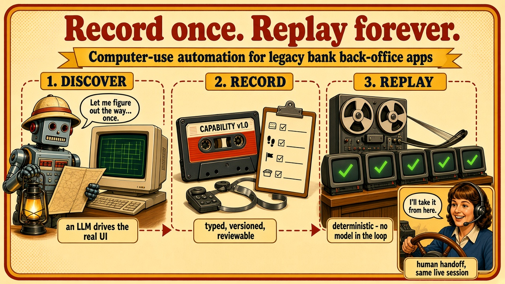
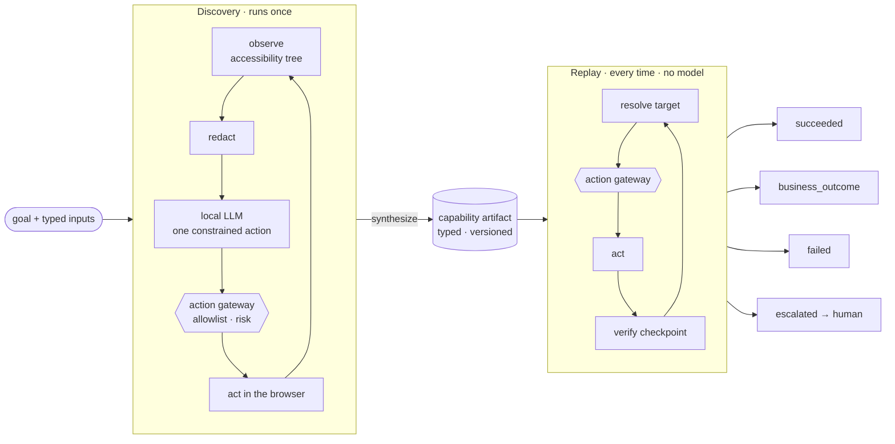
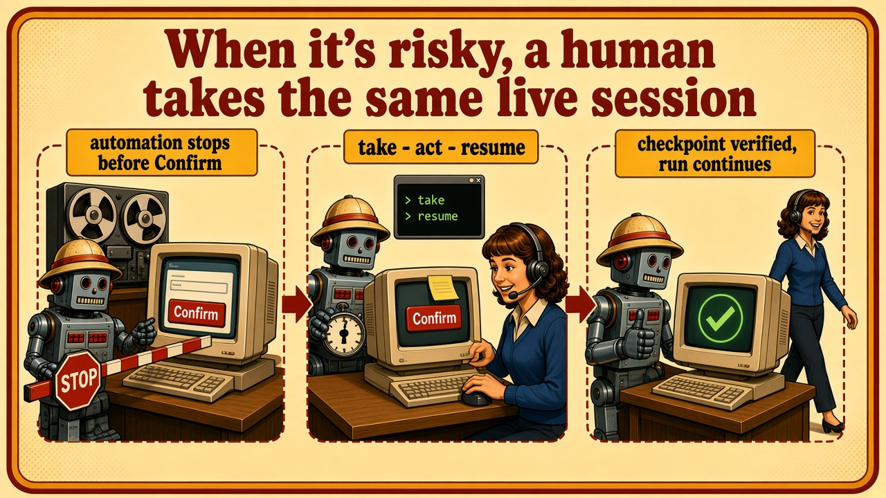
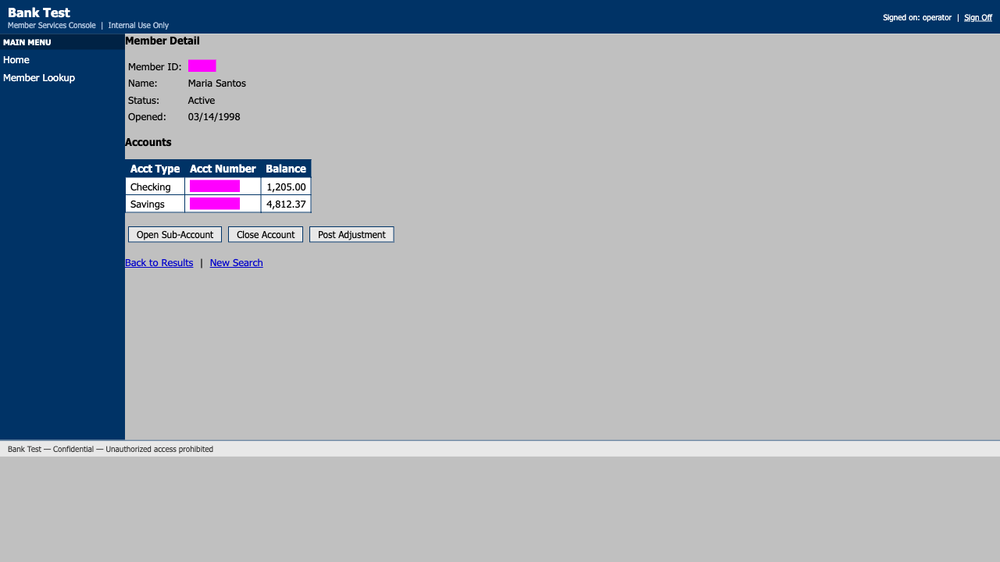

<h1 align="center">Computer-use automation for legacy back-office apps</h1>

<p align="center">
  
  
  
  
  
  
</p>

<h3 align="center">A language model learns a legacy bank screen once.<br/>Replay runs it forever — without the model.</h3>

<p align="center">
  
</p>

## The problem

Banks and credit unions run back-office screens that have no API: core banking
consoles, servicing tools, admin panels built on framesets and nested tables. An AI
agent that needs to get work done there can reason about the screen every single time
— slow, expensive and non-deterministic, which a regulated institution will not
accept — or it can learn the flow **once** and execute it mechanically from then on.

This system does the second.

## What it does

- **Discovers** a flow with a real language model driving a real browser against a
  deliberately hostile legacy UI — **local by default** (Ollama), so observations of
  the screen never leave the machine.
- **Records** the successful run as a **capability artifact**: typed inputs and
  outputs, ordered steps, robust targets, a checkpoint per step and the business
  outcomes a caller must expect — versioned and reviewable in a pull request.
- **Replays** the artifact deterministically with **no model in the decision loop**.
  That guarantee is structural: the replay code cannot import the model client, and a
  dependency rule fails the build if it ever does.
- **Answers in one of four ways** — `succeeded`, `business_outcome`, `failed`,
  `escalated` — so "no such member" is an answer, never a crash.
- **Hands the same live session to a human** when a step is risky or the run is stuck,
  verifies the result when control comes back, and records what the human did.
- **Stays inside guardrails**: an explicit allowlist, risky actions reserved for
  humans, and redaction of secrets and financial data before anything is written.

## Highlights

| | |
|---|---|
| **Genuine local discoveries** | Both flows were discovered live by `qwen3:14b` on a laptop: the read flow in 6 decisions (31 s) and the write flow in 13 decisions (45 s), including a risky `Confirm` performed through the human handoff. |
| **Replay needs nothing** | No model, no key, no network: `npm run demo` replays eight scenarios in seconds. |
| **Enforced architecture** | Diplomat layering (pure domain, side effects at the edge) checked by dependency-cruiser on every `npm run verify`. |
| **Tested against the real thing** | 513 tests (293 unit, 220 integration), many of them driving the real target app in a real Chromium, with injected faults. |
| **Documented decisions** | Every trade-off has an [ADR or RFC](docs/README.md); [`REPORT.md`](REPORT.md) is the short version. |

## Quick start

```bash
nvm use                         # Node 24
npm install
npx playwright install chromium

npm run verify                  # typecheck, lint, 513 tests, dependency rules — offline
npm run demo                    # eight replay scenarios against the target app — no model
```

The demo's output, trimmed (each line also names the run's evidence folder):

```text
PASS  success                      expected=succeeded  got=succeeded
PASS  business outcome             expected=business_outcome:member_not_found  got=business_outcome:member_not_found
PASS  permission denied            expected=business_outcome:member_restricted  got=business_outcome:member_restricted
PASS  recovered fault              expected=succeeded+recovery:interstitial  got=succeeded+recovery:interstitial
PASS  unexpected dialog            expected=succeeded+recovery:unexpected_dialog  got=succeeded+recovery:unexpected_dialog
PASS  hard failure                 expected=failed:server_error@click-member-lookup  got=failed:server_error@click-member-lookup
PASS  handoff (scripted operator)  expected=succeeded+intervention  got=succeeded+intervention
PASS  escalation, no operator      expected=escalated:no_operator_surface@close-account  got=escalated:no_operator_surface@close-account

8/8 as expected — replay ran with no reasoner and no model env
```

To discover a flow yourself you also need the local model — see [Setup](#setup).

## How it works



The model sees a compact accessibility tree, not raw HTML, with credentials and every
sensitive output already read masked (inputs stay visible: it has to type them). It
must answer with one JSON action whose target is constrained — during generation — to
elements that exist on the current screen. The model is stateless, so its goal line
says which outputs are already read and what a person did during a handoff. Every
action on both paths passes through one gateway that enforces the allowlist. The
replay side has no edge to the model at all.

## Watch the model think

The real decisions `qwen3:14b` made while discovering the read flow, straight from the
committed [evidence](evidence/runs/2026-09-24T21-39-10-424Z-discovery-member.read-account-balance/run.jsonl).
Sensitive values were redacted before they were written:

| # | Action | Model's rationale | Latency |
|---|---|---|---|
| 1 | `click` Member Lookup | "Clicking on Member Lookup to proceed with looking up member [REDACTED:internal]." | 12.7 s (first call) |
| 2 | `fill` Member ID | "Need to enter the member ID to look them up." | 2.3 s |
| 3 | `click` Search | "Clicking the search button will look up member [REDACTED:internal]." | 2.2 s |
| 4 | `click` the member | "Clicking the member's name will navigate to their details, where the Savings account balance can be found." | 2.7 s |
| 5 | `read` balance | "The balance of the Savings account is displayed in e26." | 3.4 s |
| 6 | `finish` | "The goal was to read the balance of member [REDACTED:internal]'s Savings account, which has been accomplished." | 4.3 s |

Each decision also records Ollama's own metadata (`providerMeta`: token counts, durations).

## The artifact

The run above became [`capabilities/member.read-account-balance/1.0.2.json`](capabilities/member.read-account-balance/1.0.2.json):
discovery writes it as a `draft`, and a reviewer approved it. A caller sees a contract —
typed inputs, typed outputs, declared outcomes — not a recording. Targets are described
the way an operator would find them, never by a brittle selector, and each says why its
locators should hold:

```json
"content.balance": {
  "frame": "content",
  "candidates": [
    {
      "strategy": "table_cell",
      "row": { "column": "Acct Type", "equals": "{{inputs.accountType}}" },
      "column": "Balance"
    }
  ],
  "notes": "Cell located by its row (Acct Type = {{inputs.accountType}}) and column header (Balance), not by position or by its own text (record data), so it survives row reordering and works for any record. Searched only inside the content frame."
}
```

```json
{
  "id": "read-balance",
  "action": { "kind": "read", "target": "content.balance", "output": "balance" },
  "risk": "safe",
  "checkpoint": { "kind": "target_visible", "target": "content.balance" }
}
```

The value `10001` the model typed became `{{inputs.memberId}}`, so the same artifact
works for any member; the balance cell is found by its row, so it still works for a
member whose Savings account is the third row. Business outcomes (`member_not_found`,
`member_restricted`) and recoverable conditions (an interstitial page) are declared,
never guessed. The schema is specified in [RFC-002](docs/rfcs/RFC-002-capability-artifact-schema.md).

<p align="center">
  
</p>

| Status | Exit code | Example |
|---|---|---|
| `succeeded` | 0 | typed outputs: `{ "balance": "3,100.55" }` |
| `business_outcome` | 2 | `member_not_found`, `member_restricted` (permission denied), `invalid_initial_deposit` — the caller decides |
| `failed` | 3 | `server_error` at step `click-member-lookup`, with expected, observed and a screenshot |
| `escalated` | 4 | a human was needed and the run could not continue without one |

Recoverable conditions — a slow load, an interstitial page, an expired session, an
unexpected native dialog (dismissed) — are handled inside the run with bounded retries
and reported in `recoveries[]`. After re-authenticating, a run starts over, unless a
risky step is already done: then it fails rather than repeat it.

<p align="center">
  
</p>

## The target app

No real bank system may be used, so the target is [`fixture/`](fixture/README.md): a
local, deliberately hostile 2000s-era member-services console — iframe shell, nested
tables, presentational markup, no test IDs, ASP.NET-style generated names, native
`confirm()` dialogs, irreversible buttons, and a fault-injection endpoint that makes
slowness, interstitials, session expiry, server errors and missing controls happen on
demand. This is a screenshot from the committed discovery run (declared sensitive
values and account numbers are masked):

<p align="center">
  
</p>

---

## Requirements

- Node 24 (`.nvmrc`) and npm
- Chromium for Playwright (installed below)
- For discovery only: [Ollama](https://ollama.com) with `qwen3:14b` (about 9 GB of
  disk and 10 GB of free memory), or any OpenAI-compatible endpoint

Tests, the demo and replay need no model, no key and no network.

## Setup

```bash
nvm use                         # Node 24
npm install
npx playwright install chromium
```

### Model setup (discovery only)

```bash
brew install ollama             # or the installer from ollama.com
ollama serve                    # or: brew services start ollama
ollama pull qwen3:14b
```

`qwen3:14b` is the default because `qwen3:8b` failed the first live decision 3 times
out of 3 while `qwen3:14b` got it right 3 out of 3 (ADR-015). To use a hosted model
instead, pass `--reasoner hosted` to `discover` and set `HOSTED_BASE_URL` (an
OpenAI-compatible base URL, e.g. `https://api.openai.com/v1`), `HOSTED_MODEL` and
`HOSTED_API_KEY`. The hosted path is never chosen automatically.

## Configuration

Everything is read from environment variables, and every default targets the local
fixture, so nothing needs to be set. [`.env.example`](.env.example) lists them; nothing
loads `.env` automatically, so export what you change (e.g.
`cp .env.example .env`, edit, then `set -a && . ./.env && set +a`).

| Variable | Default | Used by |
|---|---|---|
| `TARGET_USERNAME`, `TARGET_PASSWORD` | the fixture's demo credentials ([`fixture/README.md`](fixture/README.md)) | sign-in over HTTP before each run (ADR-013) |
| `OLLAMA_BASE_URL` | `http://localhost:11434` | `discover` (local); must be a loopback address so observations stay on the machine |
| `REASONER_MODEL` | `qwen3:14b` | `discover` (local) |
| `HOSTED_BASE_URL`, `HOSTED_MODEL`, `HOSTED_API_KEY` | unset | `discover --reasoner hosted`; the base URL must be `https:` unless it is loopback |
| `EVIDENCE_DIR` | `evidence/runs` | where each run's evidence folder is written; a relative path resolves from the repository root |
| `REPLAY_STEP_TIMEOUT_MS` | `5000` | per-step budget in replay |
| `DISCOVERY_STEP_TIMEOUT_MS` | `5000` | per-action budget in discovery |
| `HANDOFF_TTL_MS` | `600000` (10 min) | how long a handoff waits for the operator |
| `OPERATOR_ID` | `local-operator` | who is recorded as taking and resuming a handoff |

The allowlist is [`policy.json`](policy.json) (origins, routes, action types, risky
routes and control text); it allows `http://localhost:8080`, where `npm run fixture`
listens.

## Run without live services

```bash
npm run verify    # typecheck, lint, tests (fixture on a free port, scripted model), dependency rules
npm run demo      # replays the committed capabilities in eight scenarios; no model, no model env
```

`npm run demo` starts the fixture itself, replays against it, and prints one line per
scenario (expected result, actual result, evidence folder), then `8/8 as expected`
(exit 0). Faults are injected through the fixture's
`/_fault` endpoint right before the step they target; the handoff scenario uses a
scripted operator that types `take` and `resume` at the real handoff prompt and clicks
in the run's own page. Evidence goes to a temp dir; `npm run demo -- --keep` writes it
to `evidence/runs/` instead.

## Demo path: discover, then replay

Terminal 1 — the target app:

```bash
npm run fixture                 # http://localhost:8080
```

Terminal 2 — **discover** the read flow with the local model. Published versions are
immutable and `1.0.2` is committed, so ask for a new version:

```bash
npm run discover -- --request discovery/requests/member.read-account-balance.json --version 1.0.3
```

Each decision and its rationale is printed as it happens; the result is JSON on
stdout (exit 0 `succeeded`, 3 `failed`, 4 `escalated`). The new artifact is written
with `"status": "draft"` to `capabilities/member.read-account-balance/1.0.3.json`, and
the run's evidence to `evidence/runs/<run>/`. Review it (a new file in `git status`,
comparable with the committed `1.0.2.json`) and set `"status": "approved"` before
committing it.

The same discovery with the goal in natural language on the command line instead of a
request file (`{{name}}` marks an input; each `--input` gives the example the model
uses, and its sensitivity, `internal` when omitted):

```bash
npm run discover -- --goal "Look up member {{memberId}} and read the balance of their {{accountType}} account" \
  --capability member.read-account-balance --version 1.0.3 \
  --input memberId=10001:internal --input accountType=Savings:none \
  --output balance:financial --outcome member_not_found
```

**Replay** the artifact you just discovered — no model is involved. `@1` resolves to
the latest `1.x`; `--allow-draft` lets it pick your unreviewed `1.0.3` (without it,
replay only runs approved versions and uses the committed `1.0.2`):

```bash
npm run replay -- --capability member.read-account-balance@1 --allow-draft --input memberId=10002 --input accountType=Savings
# exit 0: "status": "succeeded", "outputs": { "balance": "3,100.55" }

npm run replay -- --capability member.read-account-balance@1 --allow-draft --input memberId=99999 --input accountType=Savings
# exit 2: "status": "business_outcome", "outcome": "member_not_found"

npm run replay -- --capability member.read-account-balance@1 --allow-draft --input memberId=abc --input accountType=Savings
# exit 3: "status": "failed", "failure": { "stepId": "inputs", "code": "invalid_input", ... }
```

Replay exit codes: 0 `succeeded`, 2 `business_outcome`, 3 `failed`, 4 `escalated`,
1 usage or configuration error, 5 internal error (a crash, not a result of the run).
Outputs are returned unmasked on stdout; in the evidence they are redacted.

## Human handoff

The write flow ends with a risky `Confirm`, which automation never performs. Replay
the committed, model-discovered `member.open-sub-account@1` with a visible browser:

```bash
npm run replay -- --capability member.open-sub-account@1 --input memberId=10002 \
  --input "accountType=Holiday Club" --input nickname=Vacation --input initialDeposit=100.00 --headed
```

Automation fills the form and stops before `click-confirm`. The terminal prints the
intervention request (also written to `intervention.json`) and a `handoff>` prompt:

1. type `take` — you now own the session; the gateway refuses automation actions
2. click **Confirm** in the browser window; the page's `confirm()` dialog is answered
   at the `dialog>` prompt: type `accept`
3. type `resume` — the run re-observes the page and verifies the step's checkpoint
   before continuing (if it does not hold, control comes back to you), then reads the
   new account number: exit 0

`abort` ends the run as `escalated` (`aborted`, exit 4); so do an expired
`HANDOFF_TTL_MS` (`ttl_expired`) and a closed window (`surface_closed`). Without
`--headed` there is no operator surface and the run ends at once as `escalated`
(`no_operator_surface`). What the human did (clicks, navigations, dialog answers,
typed values as `[redacted]`) is recorded as `handoff_*` events with before/after
screenshots.

With `--headed`, replay also hands over a step that fails in a way no declared recovery
handles (a missing control, a checkpoint that does not hold); without an operator
window that run ends `failed`.

To rediscover the write flow yourself, run
`npm run discover -- --request discovery/requests/member.open-sub-account.json --version 1.0.2 --headed`;
when the model's click on `Confirm` is escalated, do the same `take`, click, `accept`,
`resume`. The model is then told what you did, reads the new account number and
finishes.

## Evidence

[`evidence/README.md`](evidence/README.md) indexes the committed runs: the two genuine
local-model discoveries (read flow, 6 decisions in 31 s; write flow, 13 decisions in
45 s with a handoff), their artifacts, and replays covering success, business outcomes
(member not found, permission denied, a rejected deposit), a recovered fault, a
dismissed unexpected dialog, a hard failure, handoffs and an escalation with no
operator. Screenshots are masked: declared sensitive values and account numbers are
covered by boxes. The operator actions in the committed handoffs were performed by a scripted
operator through the real handoff channel; the evidence index explains how.

## What is mocked, and why

| Mocked | Instead | Why |
|---|---|---|
| A bank's back-office app | [`fixture/`](fixture/README.md), a local legacy-style app with seeded synthetic members and injectable faults | no real bank system may be used; the fixture reproduces the hard parts on demand (ADR-004) |
| The operator console | the run's own headed browser window plus the `handoff>` prompt on stdin, on the same machine | the control-transfer model is real; a console that streams the session (CDP screencast) and queues requests is UI work with no new decisions (RFC-005) |
| The operator in committed handoff evidence | a scripted operator using the same prompt and page | a recording has to be reproducible; the steps for a person are above |
| Credential storage | environment variables; sign-in over HTTP, cookie injected into the browser | authentication is a precondition, not a recorded step (ADR-013) |
| Desktop surfaces, other tenants and per-tenant overlays, drift detection | design only, with the seams in code; the fixture is the only tenant | out of scope for v1 (RFC-007) |
| The model in `npm run verify` | a scripted reasoner; real calls are opt-in with `npm run test:live` | tests must run offline and deterministically |

## Layout

```text
src/
  models/ logic/        domain types (Zod) and pure rules: policy, checkpoints, classification, redaction, synthesis
  controllers/          discovery, replay, escalation
  adapters/ wire/       external formats <-> domain
  diplomat/             CLI entrypoints, the composition root (shared by both CLIs, the tests and the demo) and I/O:
                        surface (Playwright), reasoner, session, gateway, store, evidence, escalation
  infrastructure/       config, clock, ids
capabilities/           versioned capability artifacts
discovery/              capability requests and per-app outcome catalogs (discovery input)
evidence/               curated sample runs
fixture/                the target app
scripts/                the no-model demo and its helpers (fixture control, scripted operator)
tests/                  unit, integration (real fixture and browser), live (opt-in, real model)
policy.json             the allowlist
assets/                 README illustrations
```

## Design docs

- [`REPORT.md`](REPORT.md) — architecture, artifact schema, determinism and error
  handling, heterogeneity and multi-tenant, escalation and handoff, safety, cuts
- [`docs/README.md`](docs/README.md) — RFCs and ADRs behind each decision
