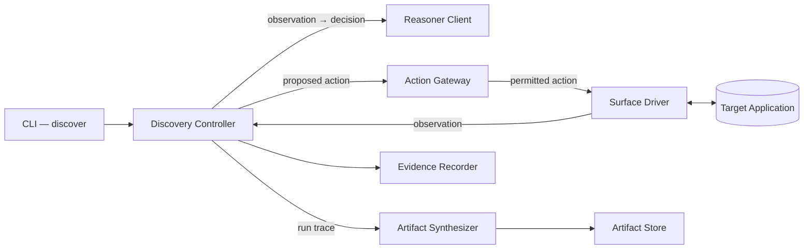
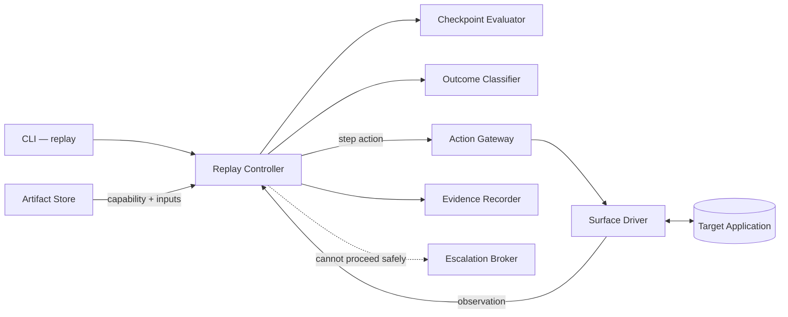

# System Scope & Component Landscape (v1)

---

| Field | Value |
|---|---|
| **RFC** | RFC-001 |
| **Author** | Marcio Dias |
| **Contributors** | N/A |
| **Started at** | 2026-08-19 |
| **Status** | ACCEPTED |
| **Description** | This RFC defines what the computer-use automation system does in its first version, the components it is made of, how those components map onto the Diplomat layering, and which concerns are deliberately excluded. It is the anchor document that later RFCs specialize. |

---

## Context

Financial institutions run back-office applications that expose no API. Servicing
tools, core banking screens, and administrative consoles are operated by people
clicking through a user interface, and there is no other way in.

An AI agent that needs to get work done inside those applications has two options.
It can reason about the interface every time it acts — which is slow, expensive,
and non-deterministic, and therefore unacceptable in a regulated environment. Or
it can learn the flow once and then execute it mechanically.

This system implements the second option:

> The model discovers. The artifact becomes a reusable capability. Deterministic
> replay is how the agent invokes it in production.

Three properties of the real environment shape every decision that follows.

**The interfaces are stable, but runtime conditions are not.** These are
slow-moving enterprise applications, which is what makes record-once/replay-many
viable in the first place. The hard problem is not that selectors rot; it is that
a replay must survive validation errors, missing records, permission denials,
unexpected dialogs, session expiry, transient slowness, and outright application
errors. A capability that only works on the happy path has no production value.

**The surfaces are heterogeneous and frequently legacy.** Server-rendered pages,
framesets, deeply nested tables, non-semantic markup, no test identifiers —
sometimes not a browser at all. A clean DOM cannot be assumed.

**The same product runs at many institutions, configured differently.** A
capability recorded against one tenant should generalize, or degrade in an
obvious way, rather than being re-recorded from scratch.

---

## Goals

- Define the functional scope of v1
- Describe the discovery, replay, and escalation paths end to end
- Identify the components, their responsibilities, and their boundaries
- Establish which guarantees are structural rather than procedural
- Provide the shared vocabulary that later RFCs build on

---

## Non-Goals

This RFC does **not**:

- Specify the capability artifact schema — see RFC-002
- Specify the discovery loop's perception model or prompting — see RFC-003
- Specify the replay result contract or error taxonomy — see RFC-004
- Specify the escalation and control-transfer mechanism — see RFC-005
- Specify the guardrail policy model — see RFC-006
- Commit to multi-surface or multi-tenant implementation — see RFC-007

---

## The Two-Phase Model

```text
goal in natural language
        │
        ▼
[ DISCOVERY ]   A model observes, decides, and acts against the live surface.
                Expensive, slow, non-deterministic. Runs once.
        │
        ▼
[ ARTIFACT ]    A typed, versioned, parameterized capability contract.
                Reviewable by a human and callable by an agent.
        │
        ▼
[ REPLAY ]      Executes the contract with no model in the decision loop.
                Cheap, fast, deterministic. Runs continuously.
        │
        ├─→ success, with typed outputs
        ├─→ a known business outcome ("no such member")
        ├─→ a hard failure, with enough detail to debug
        └─→ stuck → hand control of the live session to a human
```

The distinction between the third and fourth outcomes above is the one this
system most needs to get right. A caller that receives only "it failed" cannot
make a business decision. "No such member" is an answer, not a crash.

---

## Component Landscape

### Discovery path



### Replay path



**The reasoner client does not appear in the second diagram, and it is not
reachable from any node in it.** That absence is the system's central guarantee,
expressed structurally rather than as a runtime condition. See ADR-001.

---

## Components

| Component | Diplomat layer | Responsibility |
|---|---|---|
| **CLI** | Diplomat (inbound) | Parses a goal or a capability invocation, calls a controller, renders the result |
| **Discovery Controller** | Controller | Runs the observe → decide → act loop until the goal is met or a stopping condition fires |
| **Replay Controller** | Controller | Executes a capability's steps against the surface and produces a structured result |
| **Escalation Controller** | Controller | Suspends a run, publishes an intervention request, awaits and validates resumption |
| **Reasoner Client** | Diplomat (outbound) | Calls the language model — a local model by default, a hosted one on request (ADR-015). Exists only on the discovery path |
| **Surface Driver** | Diplomat (outbound) | Observes and acts on a live application. The seam for surface heterogeneity |
| **Action Gateway** | Diplomat | The single point through which every action reaches a surface. Where guardrail policy is applied |
| **Artifact Store** | Diplomat (outbound) | Persists and loads versioned capability artifacts |
| **Evidence Recorder** | Diplomat (outbound) | Writes a structured record of what happened and why, plus richer signal on failure |
| **Escalation Broker** | Diplomat (outbound) | Delivers the intervention request and exposes the live session for manual control |
| **Session Provider** | Diplomat (outbound) | Establishes the authenticated session before a run from environment credentials, logging in over HTTP so the password never enters the browser. Outside the action gateway because signing in is not an agent action (ADR-013) |
| **Artifact Synthesizer** | Logic | Turns a successful run trace into a parameterized capability. Pure |
| **Checkpoint Evaluator** | Logic | Decides whether an observation satisfies a step's success condition. Pure |
| **Outcome Classifier** | Logic | Maps an observation to a business outcome, a recoverable condition, or a hard failure. Pure |
| **Guardrail Policy** | Logic | Decides whether a proposed action is permitted. Pure |

Two placements are worth stating explicitly.

**The guardrail policy is Logic; the gateway that enforces it is a Diplomat.**
Deciding whether an action is allowed is a pure function of the action, the
target, and the configured policy — testable with plain values. Refusing to
perform the action is an I/O concern. Separating them means the policy is
exhaustively unit-testable and the enforcement point is single and obvious.

**The action gateway is a choke point, not a layer.** Every action, on both paths,
passes through it. There is no route to the surface that bypasses policy.

---

## Execution Paths

### Discovery

1. The CLI accepts a goal in natural language and a target entry point.
2. The discovery controller obtains an observation of the current state from the
   surface driver.
3. The observation is sent to the reasoner client, which returns a proposed
   action.
4. The proposed action is submitted to the action gateway. If policy rejects it,
   the rejection is fed back as an observation rather than terminating the run.
5. Permitted actions are executed by the surface driver, producing a new
   observation.
6. The loop continues until the goal's success condition holds, or a stopping
   condition fires: a step budget, a wall-clock timeout, or a dead end.
7. On success, the artifact synthesizer converts the run trace into a capability
   artifact, and the artifact store persists it.
8. The evidence recorder captures the full trace, including the reasoning behind
   each action.

The run trace and the artifact are distinct. The artifact is a deliberate
contract, decoupled from the model transcript that produced it.

### Replay

1. The CLI accepts a capability reference and its typed input parameters.
2. The artifact store loads the artifact. Because it comes from disk, it is
   untrusted input and is validated before use.
3. Input parameters are validated against the artifact's declared input contract.
4. Each step is executed in order through the action gateway.
5. After each step, the checkpoint evaluator verifies that the expected state was
   actually reached — the click is never assumed to have worked.
6. If the observed state does not satisfy the checkpoint, the outcome classifier
   determines whether it is a declared business outcome, a recoverable condition,
   or a hard failure, and the controller responds accordingly.
7. On completion, declared outputs are extracted and returned in a structured
   result.

No step consults a model. The controller has no dependency through which it
could.

### Escalation

Escalation is available on both paths, triggered when the system cannot proceed
safely: discovery has reached a dead end, replay has hit a condition it cannot
recover from, or a step has been classified as risky and requires a human
decision.

The run suspends, an intervention request carrying enough context to act on is
published, and the **same live session** is exposed for manual control. When the
human signals completion, control returns and the run resumes or completes. What
the human did is recorded as evidence.

Handing over the same session — rather than starting a fresh one — is the
requirement that constrains the design, because authenticated state and
accumulated progress are expensive to rebuild.

---

## Cross-Cutting Concerns

### Guardrails

An explicit, configurable allowlist bounds what the system may do: which
origins and routes are reachable, and which action types are permitted. Actions
are additionally classified as safe/reversible or risky/irreversible, with the
risky class handled conservatively. Violations are **prevented** at the gateway,
not merely logged.

Secrets and raw sensitive values never reach artifacts or evidence.

Detailed in RFC-006.

### Evidence

Every run writes a structured, machine-readable record of what happened and, on
the discovery path, why each action was chosen. Failures additionally capture a
richer signal — a screenshot, a state snapshot — sufficient to reconstruct what
the system saw.

Evidence serves two audiences: an operator debugging a production failure, and a
reviewer verifying that a run genuinely occurred.

---

## Scope (v1)

### In scope

- A goal-driven discovery loop against a live surface, with real model calls to
  a local model by default
- A typed, versioned, parameterized capability artifact
- Deterministic replay with checkpoint verification and typed outputs
- An explicit result contract separating business outcomes, recoverable
  conditions, and hard failures
- Allowlist enforcement and risk classification at a single gateway
- Redaction of secrets and sensitive values
- Structured evidence for both discovery and replay runs
- A real escalation mechanism that transfers control of the live session and
  resumes

### Out of scope

- Any surface other than the browser, implemented
- Multi-tenant artifact resolution, implemented
- A production operator console
- Queues, workers, service decomposition, or a database
- Self-healing locators or automatic recovery from interface redesign
- Authentication as a recorded step — see ADR-013

The distinction between *designed for* and *implemented* is deliberate.
Heterogeneous surfaces and cross-tenant reuse are answered as design questions in
RFC-007, with the seams present in the code, and are not built.

---

## Consequences

### Positive

- The determinism guarantee is verifiable from the dependency graph
- The safety-critical rules — policy, checkpoints, classification — are pure and
  testable without a browser or a model
- Surface heterogeneity has a single, identified seam
- Every action passes through one enforcement point
- Escalation is a first-class path rather than an error branch

### Negative

- Single-process execution means one session at a time and no durable run history
- The escalation window is bounded by the process lifetime
- The layering costs files and indirection relative to a direct implementation
- Deferring multi-surface and multi-tenant work to design means those claims rest
  on argument, not demonstration

These trade-offs are accepted and revisited in the RFCs that own them.

---

## Related

- Service Design Principles
- ADR-001 — Diplomat Architecture as Service Structure
- ADR-002 — TypeScript on Node as Language and Runtime
- ADR-003 — Single Process, CLI-First Composition
- ADR-004 — Purpose-Built Legacy Fixture as Target Surface
- RFC-002 — Capability Artifact: Schema & Contract
- RFC-004 — Deterministic Replay & Execution Result Contract
- RFC-005 — Human-in-the-Loop Escalation & Session Handoff
- RFC-006 — Safety, Guardrails & Regulated Data Handling
- RFC-007 — Surface Abstraction & Multi-Tenant Capability Reuse
