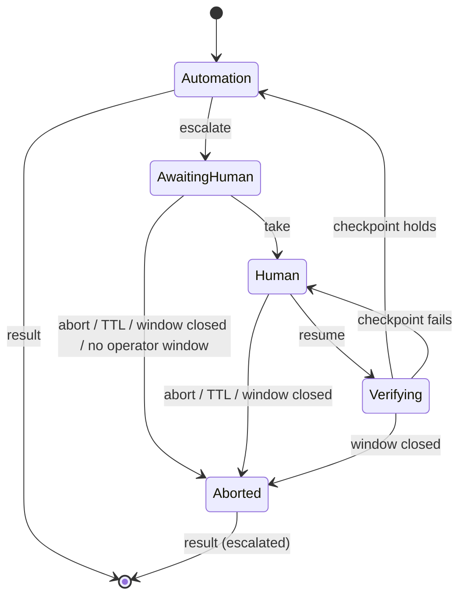

# Human-in-the-Loop Escalation & Session Handoff (v1)

---

| Field | Value |
|---|---|
| **RFC** | RFC-005 |
| **Author** | Marcio Dias |
| **Contributors** | N/A |
| **Started at** | 2026-09-24 |
| **Status** | ACCEPTED |
| **Description** | Defines when a run escalates to a human, what the intervention request contains, how control of the live session is transferred and returned, and what is recorded. |

---

## Triggers

- Discovery dead end or `request_help` (RFC-003)
- Replay condition that cannot be recovered and is configured to escalate (RFC-004)
- A step marked risky (ADR-011)

## Intervention request

Written to `evidence/runs/<run>/intervention.json` and printed by the CLI:

```json
{
  "interventionId": "int_…",
  "runId": "…",
  "mode": "replay",
  "goal": "…",
  "capability": "member.open-sub-account@1",
  "stepId": "confirm-open",
  "reason": "risky_action",
  "message": "Step requires human approval: Confirm",
  "screenshot": "screenshots/0007.png",
  "url": "http://localhost:8080/member/subacct/review",
  "requestedAt": "…",
  "expiresAt": "…"
}
```

`mode` is `discovery` or `replay`; `reason` is `risky_action`, `stalled`, or
`help_requested`. `intervention.json` holds the latest request of the run; every
request is also a `handoff_requested` event.

## Control state machine



- The operator types `take`, `resume`, or `abort` at the stdin prompt of the
  running process.
- The run moves to Aborted on `abort`, on TTL expiry (default 10 min), or when
  the browser window is closed.
- One owner at a time (ADR-012). The gateway rejects automation actions unless the
  owner is `automation`. While Verifying, automation only observes.
- The operator works in the same headed browser window. Without `--headed` there
  is no operator surface, and the run ends immediately as `escalated`
  (`no_operator_surface`).
- Native dialogs raised during the handoff are answered at the terminal and
  recorded.
- On resume, the run re-observes and verifies the current step's checkpoint before
  continuing — the human's word is not taken on faith. Discovery has no step
  checkpoint: a changed page records what the human did, an unchanged one tells
  the model the human declined (RFC-003).
- A handoff that ends in Aborted ends the run as `escalated`, with `reason`
  `aborted`, `ttl_expired`, `surface_closed`, or `no_operator_surface` (ADR-009).

## What is recorded

- The intervention request
- Human actions (clicks, inputs with values redacted, navigations, dialog
  answers) with timestamps
- Snapshots before and after the handoff
- Who resumed or aborted, and when

As `run.jsonl` events: `handoff_requested`, `handoff_taken`,
`handoff_human_action` (one per action), `handoff_verify_failed`,
`handoff_resumed`, `handoff_aborted`; snapshots and screenshots are named
`handoff-<interventionId>-before|after`. The page script sends `[redacted]` in
place of a field's value, and navigations keep only origin and path.

## Mocked in v1

The operator surface is the browser window plus a CLI prompt. The production design
is a web console that streams the session (CDP screencast), queues intervention
requests, and lets any available operator claim one. The control model above does
not change.

## Related

- ADR-003 — Single Process, CLI-First Composition
- ADR-012 — Same-Session Control Transfer for Human Handoff
- ADR-009 — Discriminated-Union Execution Result Contract
- RFC-004 — Deterministic Replay & Execution Result Contract
